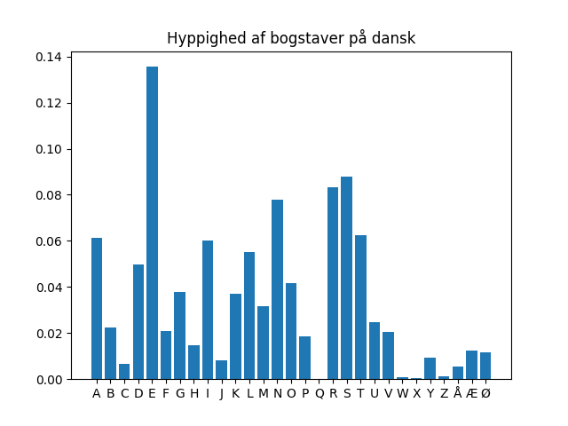

# Program til at genere spilleplader

## Kør programmet

Hvis du har hentet en ny ordbogsfil (see [README.md](./README.md)), så skal du køre preprocessing igen:

```
$ python src/preprocess.py
```

Ellers kan du bare køre generator programmet sådan her:

```
$ python src/generate.py
LITS
RMKE
GOIR
YMAT
Gemt ord: MIMIKER
```

Se også beskrivelsen af [play.py](./PLAY.md).

## Beskrivelse af algoritmen

Generator-algoritmen:
1. vælg tilfældigt et ord på mellem 8 og 12 tegn fra ordbogen
1. placer ordet tilfældigt på spillepladen ved hjælp af placerings-algoritmen
1. udfyld tomme felter ved at sample et bogstav fra det danske alfabet med sandsynlighed = frekvens af bogstav (se figur).

Placerings-algoritmen:

1. vælg et tilfældigt startsted på pladen og skriv første bogstav der
1. vælg tilfældigt en ubrugt nabo til næste bogstav
1. hvis hele ord placeret: afslut
1. hvis ikke flere ubrugte naboer, gå til 1 (prøv forfra)
1. gå til 2

Den relative frekvens af bogstaver på dansk ses i figuren herunder.



Cirka 13% af bogstaverne i danske ord er således bogstavet E, mens Æ og Ø begge udgør cirka 2% af bogstaverne i danske ord.
